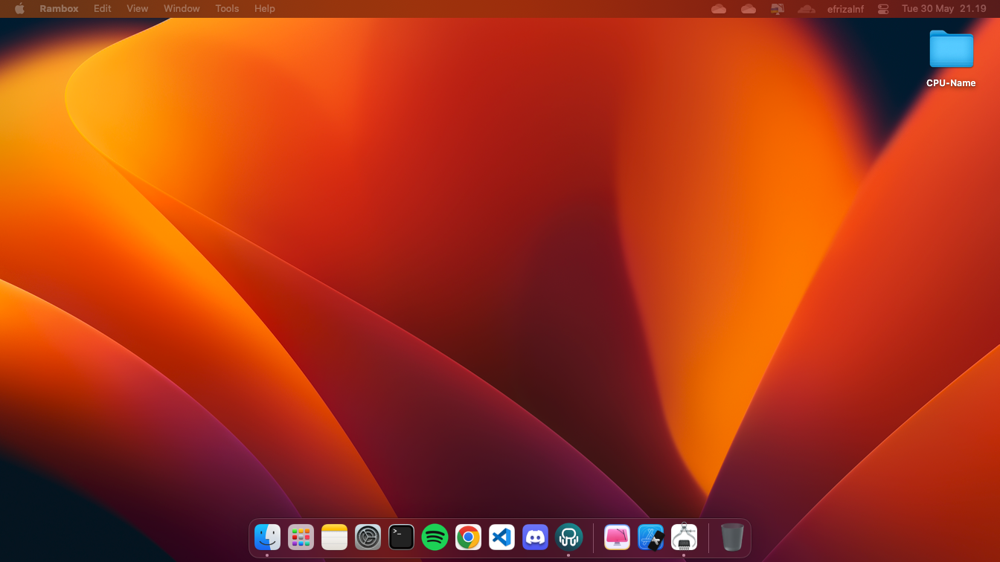
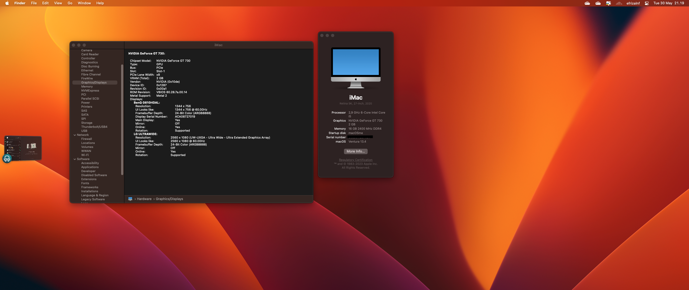

# EFI-OpenCore-H510M-H
EFI for Gigabyte H510M-H (OS Ventura 13.4)
Device Spec :
- Gigabyte H510M-H L1200
- Intel Core i5 10400
- Asus GT 730 2Gb (Kepler)
- NVME 512Gb
- Kingston Fury Dual Chanel 16Gb

Works :
(Everything work's fine : Duall Display, Audio ALC897 Codec Front and rear, USB Port, LAN, Hibernate Reboot and Shutdown working perfectly)

